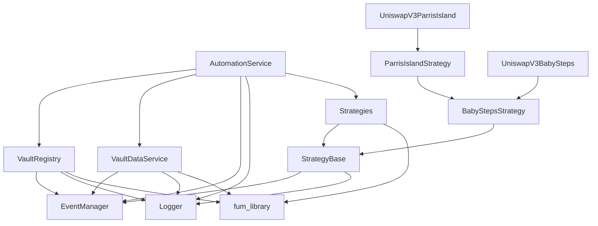

# Module Reference

Complete reference of all modules, classes, and functions in the FUM Automation Service.

## Module Overview

The FUM Automation Service is organized into logical modules, each with specific responsibilities:

```
src/
├── AutomationService.js           # Main orchestration service
├── EventManager.js               # Centralized event management
├── Logger.js                     # Structured logging system
├── VaultDataService.js           # Enhanced vault data management
├── VaultRegistry.js              # Vault discovery and authorization
└── strategies/                   # Strategy implementation system
    ├── StrategyBase.js           # Abstract strategy foundation
    ├── BabyStepsStrategy.js      # Simple automation strategy
    ├── ParrisIslandStrategy.js   # Advanced adaptive strategy
    ├── babySteps/
    │   └── UniswapV3BabyStepsStrategy.js
    └── parrisIsland/
        └── UniswapV3ParrisIslandStrategy.js
```

## Module Dependencies



## Core Services

### AutomationService
**Module**: `src/AutomationService.js`  
**Purpose**: Main orchestration service for vault automation

**Exports**:
```javascript
export default class AutomationService {
  constructor(config: AutomationConfig)
  
  // Lifecycle
  async start(): Promise<void>
  async stop(): Promise<void>
  
  // Processing
  async processVault(vault: VaultInfo): Promise<ProcessingResult>
  async processAllVaults(): Promise<ProcessingResult[]>
  
  // Strategy management
  getStrategyForVault(vault: VaultData): Strategy
  registerStrategy(strategyId: string, strategyClass: typeof StrategyBase): void
  
  // Monitoring
  async getHealthStatus(): Promise<HealthStatus>
  getMetrics(): ServiceMetrics
  
  // Utilities
  getProvider(chainId: number): ethers.Provider
  getVaultRegistry(): VaultRegistry
  getVaultDataService(): VaultDataService
  getEventManager(): EventManager
}
```

**Dependencies**: VaultRegistry, VaultDataService, EventManager, Logger, Strategy classes

**Usage**:
```javascript
import AutomationService from './src/AutomationService.js';

const service = new AutomationService(config);
await service.start();
```

---

### VaultRegistry
**Module**: `src/VaultRegistry.js`  
**Purpose**: Vault discovery and authorization tracking across multiple chains

**Exports**:
```javascript
export default class VaultRegistry {
  constructor(config: VaultRegistryConfig)
  
  // Provider management
  async initializeProvider(chainId: number): Promise<ethers.Provider>
  
  // Vault discovery
  async getAuthorizedVaults(chainId: number): Promise<VaultInfo[]>
  async getAllAuthorizedVaults(): Promise<VaultInfo[]>
  
  // Event monitoring
  async subscribeToAuthorizationEvents(chainId: number, automationServiceAddress: string, provider: Object): Promise<void> // Moved to EventManager
  async subscribeToVaultConfigEvents(vault: Object, vaultDataService: Object, provider: Object): Promise<void> // Moved to EventManager
  // async subscribeToVaultStrategyEvents - REMOVED (was not being used)
  
  // Cleanup
  async stopListeningForVault(vaultAddress: string, chainId: number): Promise<void>
  async stopListening(): Promise<void>
}
```

**Dependencies**: EventManager, Logger, ethers.js

**Usage**:
```javascript
import VaultRegistry from './src/VaultRegistry.js';

const registry = new VaultRegistry(config);
const vaults = await registry.getAuthorizedVaults(1);
```

---

### VaultDataService
**Module**: `src/VaultDataService.js`  
**Purpose**: Enhanced vault data loading with automation-specific metadata

**Exports**:
```javascript
export default class VaultDataService {
  constructor(eventManager: EventManager, logger: Logger)
  
  // Data loading
  async loadVault(vaultAddress: string, chainId: number): Promise<VaultDataResult>
  async loadUserVaults(userAddress: string, chainIds: number[]): Promise<UserVaultsResult>
  async refreshVaultPositions(vaultAddress: string, chainId: number): Promise<Position[]>
  
  // Data access
  getVault(vaultAddress: string, chainId: number): VaultData | null
  getPosition(vaultAddress: string, positionId: string, chainId: number): Position | null
  getPool(poolAddress: string, chainId: number): PoolData | null
  getToken(tokenAddress: string, chainId: number): TokenData | null
  
  // Filtering and queries
  getVaultsByFilter(filter: VaultFilter): VaultData[]
  getPositionsByVault(vaultAddress: string, chainId: number): Position[]
  
  // Real-time updates
  subscribe(vaultAddress: string, chainId: number, callback: Function): () => void
  unsubscribe(vaultAddress: string, chainId: number): void
  
  // Dynamic state
  getDynamicVaultState(vaultAddress: string, chainId: number): Promise<DynamicVaultState>
  
  // Post-transaction updates
  updateVaultAfterTransaction(vaultAddress: string, chainId: number, transactionHash: string): Promise<void>
  
}
```

**Dependencies**: EventManager, Logger, fum_library

**Usage**:
```javascript
import VaultDataService from './src/VaultDataService.js';

const dataService = new VaultDataService(eventManager, logger);
const vault = await dataService.loadVault(vaultAddress, chainId);
```

---

## Event Management

### EventManager
**Module**: `src/EventManager.js`  
**Purpose**: Centralized event lifecycle management with automatic cleanup

**Exports**:
```javascript
export default class EventManager {
  constructor()
  
  // Configuration
  setDebug(enabled: boolean): void
  setEnabled(enabled: boolean): boolean
  
  // Internal events
  subscribe(event: string, callback: Function): () => void
  emit(event: string, ...args: any[]): void
  
  // Blockchain events
  registerContractListener(options: ContractListenerOptions): string
  registerFilterListener(options: FilterListenerOptions): string
  registerInterval(options: IntervalOptions): string
  
  // Cleanup
  async removeListener(key: string): Promise<boolean>
  removeAllVaultListeners(vault: VaultInfo): number
  removeChainListeners(chainId: number): number
  async removeAllListeners(): Promise<number>
  
  // Utilities
  generateListenerKey(options: KeyOptions): string
  getVaultListenerKeys(vaultAddress: string): string[]
  hasListener(key: string): boolean
  getListenerCount(): number
}
```

**Dependencies**: ethers.js

**Usage**:
```javascript
import EventManager from './src/EventManager.js';

const eventManager = new EventManager();
const key = await eventManager.registerContractListener({
  contract: vaultContract,
  eventName: 'ParametersUpdated',
  handler: handleUpdate,
  vaultAddress: vault.address,
  eventType: 'strategy',
  chainId: 1
});
```

---

### Logger
**Module**: `src/Logger.js`  
**Purpose**: Structured logging with automation context and action tracking

**Exports**:
```javascript
// Singleton instance
export default logger: Logger

class Logger {
  constructor()
  
  // Configuration
  setDebugMode(enabled: boolean): void
  
  // Logging methods
  log(level: string, source: string, message: string, data?: Object, actionType?: string, actionResult?: string): void
  info(source: string, message: string, data?: Object, actionType?: string, actionResult?: string): void
  warn(source: string, message: string, data?: Object, actionType?: string, actionResult?: string): void
  error(source: string, message: string, data?: Object, actionType?: string, actionResult?: string): void
  
  // Buffer access
  getRecentLogs(count?: number): LogEntry[]
}
```

**Dependencies**: None

**Usage**:
```javascript
import logger from './src/Logger.js';

logger.info('AutomationService', 'Vault processing started', {
  vaultAddress: '0x123...',
  chainId: 1
}, 'vault_processing', 'started');
```

---

## Strategy System

### StrategyBase
**Module**: `src/strategies/StrategyBase.js`  
**Purpose**: Abstract foundation for all automation strategies

**Exports**:
```javascript
export default abstract class StrategyBase {
  constructor(service: AutomationService)
  
  // Abstract methods (must implement)
  abstract async setupMonitoring(vault: VaultData, positions: Position[]): Promise<void>
  abstract async evaluateState(vault: VaultData, positions: Position[]): Promise<StateEvaluation>
  abstract async calculateOptimalAllocation(vault: VaultData, targetValue: number): Promise<AllocationResult>
  abstract async executeRebalance(vault: VaultData, allocation: AllocationResult): Promise<ExecutionResult>
  abstract async initializeVaultStrategy(vault: VaultData, positions: Position[]): Promise<void>
  
  // Provided methods
  async evaluateInitialAssets(vault: VaultData, positions: Position[]): Promise<InitialAssetsEvaluation>
  async getVaultData(vaultAddress: string, chainId: number): Promise<VaultDataResult>
  async refreshVaultPositions(vaultAddress: string, chainId: number): Promise<Position[]>
  
  // Event helpers
  async registerEventFilter(options: EventFilterOptions): Promise<string>
  async registerInterval(options: IntervalOptions): Promise<string>
  
  // Utilities
  logEvaluation(level: string, message: string, data?: Object, actionType?: string, actionResult?: string): void
  async cleanup(): Promise<void>
}
```

**Dependencies**: AutomationService, EventManager, Logger

**Usage**:
```javascript
import StrategyBase from './src/strategies/StrategyBase.js';

class CustomStrategy extends StrategyBase {
  async evaluateState(vault, positions) {
    // Custom implementation
  }
  // ... implement other abstract methods
}
```

---

### BabyStepsStrategy
**Module**: `src/strategies/BabyStepsStrategy.js`  
**Purpose**: Simple, conservative automation strategy

**Exports**:
```javascript
export default class BabyStepsStrategy extends StrategyBase {
  constructor(service: AutomationService)
  
  // Factory method
  static createForPlatform(platformId: string, service: AutomationService): BabyStepsStrategy
  
  // Strategy identification
  get type(): string  // 'bob'
  get defaultParameters(): BabyStepsParameters
  
  // Implementation methods
  async setupMonitoring(vault: VaultData, positions: Position[]): Promise<void>
  async evaluateState(vault: VaultData, positions: Position[]): Promise<StateEvaluation>
  async calculateOptimalAllocation(vault: VaultData, targetValue: number): Promise<AllocationResult>
  async executeRebalance(vault: VaultData, allocation: AllocationResult): Promise<ExecutionResult>
  async initializeVaultStrategy(vault: VaultData, positions: Position[]): Promise<void>
}
```

**Dependencies**: StrategyBase, fum_library

**Usage**:
```javascript
import BabyStepsStrategy from './src/strategies/BabyStepsStrategy.js';

const strategy = BabyStepsStrategy.createForPlatform('uniswapV3', automationService);
const evaluation = await strategy.evaluateState(vault, positions);
```

---

### ParrisIslandStrategy
**Module**: `src/strategies/ParrisIslandStrategy.js`  
**Purpose**: Advanced adaptive automation with ML integration

**Exports**:
```javascript
export default class ParrisIslandStrategy extends BabyStepsStrategy {
  constructor(service: AutomationService)
  
  // Factory method
  static createForPlatform(platformId: string, service: AutomationService): ParrisIslandStrategy
  
  // Strategy identification
  get type(): string  // 'parris'
  get defaultParameters(): ParrisIslandParameters
  
  // Enhanced methods
  async evaluateRebalance(position: Position): Promise<RebalanceEvaluation>
  async evaluateAdaptiveAdjustments(position: Position): Promise<AdaptiveAdjustments>
  async validateOracleData(position: Position): Promise<OracleValidation>
  
  // ML integration
  async generateMLFeatures(position: Position): Promise<MLFeatures>
  async applyMLPredictions(position: Position, predictions: MLPredictions): Promise<EnhancedEvaluation>
  
  // Risk management
  async assessRiskMetrics(position: Position): Promise<RiskAssessment>
}
```

**Dependencies**: BabyStepsStrategy, StrategyBase

**Usage**:
```javascript
import ParrisIslandStrategy from './src/strategies/ParrisIslandStrategy.js';

const strategy = ParrisIslandStrategy.createForPlatform('uniswapV3', automationService);
const evaluation = await strategy.evaluateRebalance(position);
```

---

### Platform Implementations

#### UniswapV3BabyStepsStrategy
**Module**: `src/strategies/babySteps/UniswapV3BabyStepsStrategy.js`  
**Purpose**: UniswapV3-specific Baby Steps implementation

**Exports**:
```javascript
export default class UniswapV3BabyStepsStrategy extends BabyStepsStrategy {
  constructor(service: AutomationService)
  
  // Platform-specific overrides
  async calculateOptimalAllocation(vault: VaultData, targetValue: number): Promise<AllocationResult>
  async generateSwapTransactionData(swapDetails: SwapDetails): Promise<TransactionData>
  async executeRebalance(vault: VaultData, allocation: AllocationResult): Promise<ExecutionResult>
  
  // UniswapV3-specific utilities
  getChainConfig(chainId: number): ChainConfig
  async getCurrentTick(poolAddress: string): Promise<number>
}
```

#### UniswapV3ParrisIslandStrategy
**Module**: `src/strategies/parrisIsland/UniswapV3ParrisIslandStrategy.js`  
**Purpose**: UniswapV3-specific Parris Island implementation

**Exports**:
```javascript
export default class UniswapV3ParrisIslandStrategy extends ParrisIslandStrategy {
  constructor(service: AutomationService)
  
  // Platform-specific methods
  async buildFeeCollectionTx(position: Position): Promise<TransactionData>
  async determineRelevantPools(vault: VaultData): Promise<PoolInfo[]>
  async executeFeeCollection(vault: VaultData, feeData: FeeCollectionData): Promise<ExecutionResult>
  async calculateOptimalAllocation(vault: VaultData, targetValue: number): Promise<AllocationResult>
  async executeRebalance(vault: VaultData, allocation: AllocationResult): Promise<ExecutionResult>
  async handleInitialPositions(vault: VaultData): Promise<InitialPositionResult>
}
```

## Type Definitions

### Common Interfaces

```typescript
// Configuration types
interface AutomationConfig {
  chains: number[]
  strategies: string[]
  defaultStrategy: string
  maxConcurrentVaults: number
  pollingIntervalMs: number
  batchSize: number
  batchDelayMs: number
  maxSlippageBps: number
  emergencyStopEnabled: boolean
  logLevel: 'debug' | 'info' | 'warn' | 'error'
  debugMode: boolean
  enableMetrics: boolean
  providers: Record<number, ProviderConfig>
}

interface VaultInfo {
  address: string
  chainId: number
  name?: string
  symbol?: string
  status?: string
}

interface VaultData {
  address: string
  name: string
  symbol: string
  chainId: number
  executor: string | null
  strategyAddress: string | null
  hasActiveStrategy: boolean
  strategy: StrategyInfo | null
  positions: Position[]
  metrics: VaultMetrics
}

interface Position {
  id: string
  platform: string
  poolAddress: string
  vaultAddress: string
  inVault: boolean
  // ... platform-specific fields
  // ... automation metadata
}

// Strategy types
interface RebalanceEvaluation {
  shouldRebalance: boolean
  reason: string
  actions: Action[]
  metadata?: Record<string, any>
}

interface BabyStepsParameters {
  targetRangeUpper: number
  targetRangeLower: number
  rebalanceThresholdUpper: number
  rebalanceThresholdLower: number
  maxSlippage: number
  emergencyExitTrigger: number
  maxUtilization: number
  feeReinvestment: boolean
  reinvestmentTrigger: number
  reinvestmentRatio: number
}

interface ParrisIslandParameters extends BabyStepsParameters {
  adaptiveRanges: boolean
  rebalanceCountThresholdHigh: number
  rebalanceCountThresholdLow: number
  adaptiveTimeframeHigh: number
  adaptiveTimeframeLow: number
  rangeAdjustmentPercentHigh: number
  thresholdAdjustmentPercentHigh: number
  rangeAdjustmentPercentLow: number
  thresholdAdjustmentPercentLow: number
  oracleSource: number
  priceDeviationTolerance: number
  maxPositionSizePercent: number
  minPositionSize: string
  targetUtilization: number
  platformSelectionCriteria: number
  minPoolLiquidity: string
}

// Event types
interface ContractListenerOptions {
  contract: ethers.Contract
  eventName: string
  handler: Function
  vaultAddress: string
  eventType: string
  chainId: number
  additionalId?: string
}

interface FilterListenerOptions {
  provider: ethers.Provider
  filter: ethers.EventFilter
  handler: Function
  vaultAddress: string
  eventType: string
  chainId: number
  additionalId?: string
}

// Logging types
interface LogEntry {
  timestamp: string
  level: string
  source: string
  message: string
  data: Record<string, any>
  actionType: string | null
  actionResult: string | null
}

// Result types
interface ProcessingResult {
  success: boolean
  vault: VaultData
  positionResults: PositionResult[]
  processingTime: number
  error?: string
}

interface HealthStatus {
  service: 'healthy' | 'degraded' | 'unhealthy'
  uptime: number
  timestamp: string
  components: Record<string, ComponentHealth>
  error?: string
}

interface ServiceMetrics {
  vaultsProcessed: number
  positionsEvaluated: number
  rebalancesExecuted: number
  feesCollected: number
  averageProcessingTime: number
  averageEvaluationTime: number
  successRate: number
  totalErrors: number
  errorsByType: Record<string, number>
  eventsProcessed: number
  activeListeners: number
  memoryUsage: NodeJS.MemoryUsage
  cpuUsage: NodeJS.CpuUsage
  strategiesByType: Record<string, number>
  startTime: number
  lastUpdate: number
  uptime: number
}
```

### Action Types

```typescript
// Common action types used throughout the system
type ActionType = 
  | 'vault_processing'
  | 'rebalance'
  | 'fee_collection'
  | 'initial_assets'
  | 'parameter_update'
  | 'emergency_exit'
  | 'oracle_validation'
  | 'ml_prediction'
  | 'adaptive_adjustment'

type ActionResult = 
  | 'started'
  | 'completed'
  | 'failed'
  | 'skipped'
  | 'no_action_needed'
  | 'partial_success'
```

### Event Names

```typescript
// Standard automation events
type AutomationEvent = 
  | 'service_started'
  | 'service_stopped'
  | 'service_degraded'
  | 'service_restored'
  | 'vault_discovered'
  | 'vault_authorized'
  | 'vault_deauthorized'
  | 'vault_removed'
  | 'vault_processing_started'
  | 'vault_processed'
  | 'vault_processing_failed'
  | 'batch_processing_started'
  | 'batch_processing_completed'
  | 'rebalance_started'
  | 'rebalance_completed'
  | 'fee_collection_started'
  | 'fee_collection_completed'
  | 'strategy_parameters_updated'
  | 'emergency_stop_triggered'
  | 'periodic_evaluation_completed'
  | 'oracle_validation_failed'
  | 'ml_prediction_applied'
  | 'adaptive_adjustment_made'
```

## Usage Examples

### Basic Service Setup

```javascript
import AutomationService from './src/AutomationService.js';

const config = {
  chains: [1, 42161],
  strategies: ['bob', 'parris'],
  defaultStrategy: 'bob',
  maxConcurrentVaults: 10,
  pollingIntervalMs: 60000,
  providers: {
    1: { rpcUrl: 'https://eth-mainnet.g.alchemy.com/v2/key' },
    42161: { rpcUrl: 'https://arb-mainnet.g.alchemy.com/v2/key' }
  }
};

const automationService = new AutomationService(config);
await automationService.start();
```

### Custom Strategy Development

```javascript
import StrategyBase from './src/strategies/StrategyBase.js';

class CustomStrategy extends StrategyBase {
  constructor(service) {
    super(service);
    this.type = 'custom';
  }
  
  async evaluateState(vault, positions) {
    // Custom evaluation logic
    return {
      shouldRebalance: false,
      reason: 'Custom logic',
      actions: []
    };
  }
  
  // Implement other abstract methods...
}

// Register and use
automationService.registerStrategy('custom', CustomStrategy);
```

### Event Monitoring

```javascript
const eventManager = automationService.getEventManager();

// Subscribe to automation events
eventManager.subscribe('rebalance_completed', (data) => {
  console.log(`Rebalance completed for ${data.vaultAddress}`);
});

// Register blockchain event listener
const key = await eventManager.registerContractListener({
  contract: vaultContract,
  eventName: 'ParametersUpdated',
  handler: (vaultAddress, newParams) => {
    console.log(`Parameters updated for ${vaultAddress}`);
  },
  vaultAddress: vault.address,
  eventType: 'strategy',
  chainId: 1
});
```

### Data Loading and Monitoring

```javascript
const dataService = automationService.getVaultDataService();

// Load vault data
const vault = await dataService.loadVault(vaultAddress, chainId);

// Subscribe to updates
const unsubscribe = dataService.subscribe(vaultAddress, chainId, (data) => {
  console.log('Vault data updated:', data);
});

// Filter vaults
const activeVaults = dataService.getVaultsByFilter({
  hasActiveStrategy: true,
  chainId: 1
});
```

## Dependencies

### External Dependencies

- **ethers.js**: Blockchain interaction and provider management
- **fum_library**: Core vault and position data management
- **axios**: HTTP requests for external APIs (CoinGecko, etc.)
- **dotenv**: Environment configuration management

### Internal Dependencies

The modules have a clear dependency hierarchy:
1. **Foundation**: Logger, EventManager (no internal dependencies)
2. **Data Layer**: VaultRegistry, VaultDataService (depend on foundation)
3. **Strategy Layer**: StrategyBase and implementations (depend on data layer)
4. **Orchestration**: AutomationService (depends on all layers)

---

For detailed documentation of each module:
- [AutomationService API](./automation-service/automation-service.md)
- [VaultRegistry API](./vault-management/vault-registry.md)
- [VaultDataService API](./vault-management/vault-data-service.md)
- [StrategyBase API](./strategies/strategy-base.md)
- [BabyStepsStrategy API](./strategies/baby-steps-strategy.md)
- [ParrisIslandStrategy API](./strategies/parris-island-strategy.md)
- [EventManager API](./utilities/event-manager.md)
- [Logger API](./utilities/logger.md)